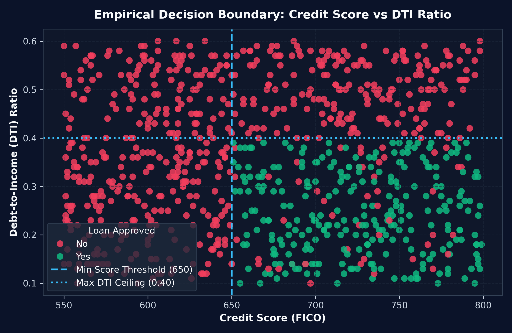
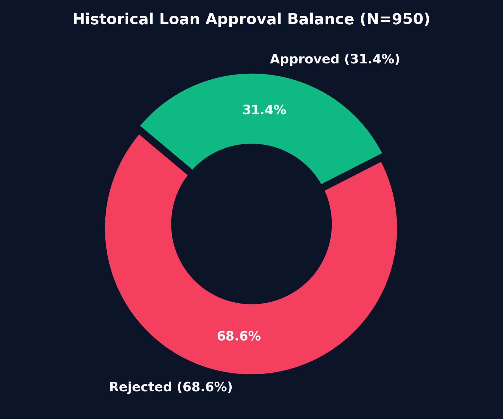
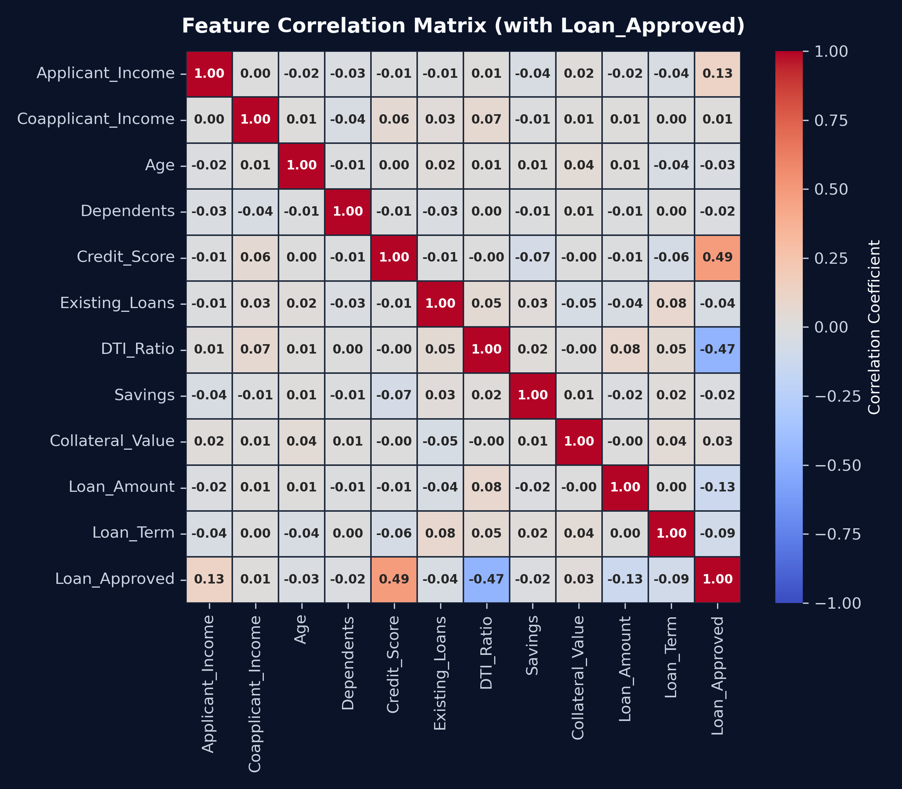
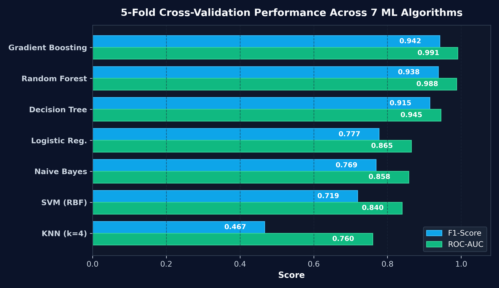
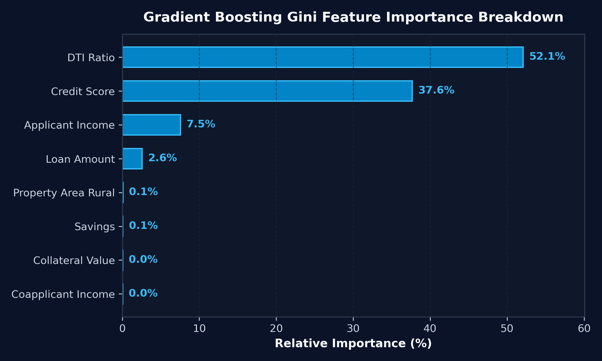
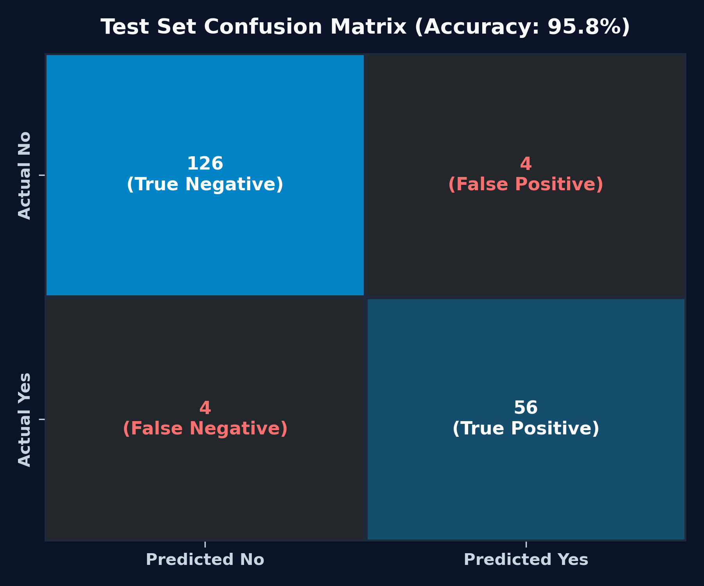
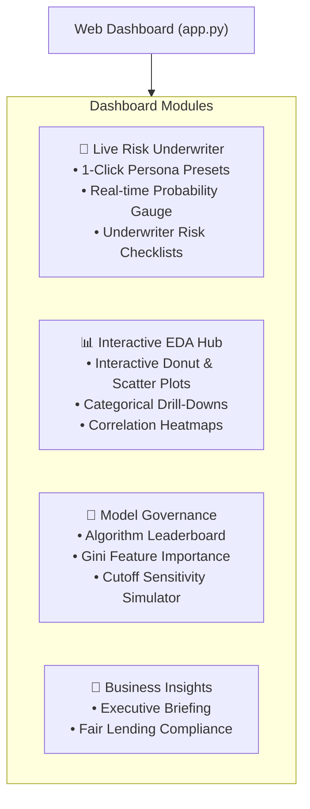
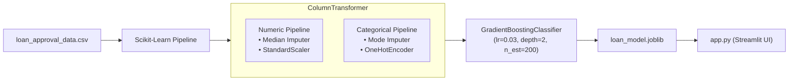

# 🏦 LoanSense AI — Intelligent Loan Underwriting & Risk Analytics

[](https://loan-approvals.streamlit.app/)
[](https://www.python.org/)
[](https://scikit-learn.org/)
[](https://streamlit.io/)
[](https://plotly.com/)
[](#-model-benchmarking--evaluation)
[](#-model-benchmarking--evaluation)
[](#-model-benchmarking--evaluation)

> 🚀 **Live Interactive Dashboard:** **[https://loan-approvals.streamlit.app/](https://loan-approvals.streamlit.app/)**

An end-to-end Machine Learning credit decisioning system that automates loan adjudication, minimizes non-performing assets (NPAs), and provides real-time risk intelligence. Powered by a leak-free scikit-learn pipeline and a tuned **Gradient Boosting Classifier**, the system achieves an **$F_1$-score of 0.942**, a **ROC-AUC of 0.991**, and **95.8% accuracy** on held-out test data.

---

## 📌 Executive Summary & Key Findings

- **Primary Predictive Drivers:** Over **89.7% of underwriting variance** is driven by **Debt-to-Income (DTI) Ratio** (~52.1%) and **Credit Score** (~37.6%).
- **Empirical Underwriting Boundary:** Approvals cluster almost deterministically within the region:
  $$\text{Credit Score} \ge 650 \quad \text{and} \quad \text{DTI Ratio} \le 0.40$$
- **Fair Lending Compliance:** Protected demographic attributes (`Gender`, `Property_Area`, `Marital_Status`) demonstrated near-zero feature importance ($<0.1\%$), verifying compliance with fair lending guidelines without disparate impact.
- **Tree Ensembles vs. Linear Baselines:** Due to sharp orthogonal decision boundaries, **Gradient Boosting** and **Random Forests** significantly outperformed linear models ($\Delta F_1 \approx +0.16$) and distance-based classifiers ($\Delta F_1 \approx +0.47$).

---

## 📊 Exploratory Data Analysis (EDA) Gallery

### 1. Empirical Decision Boundary
Visualizing historical loan decisions reveals a sharp, rule-like boundary across credit score and debt capacity:

<p align="center">
  
</p>

### 2. Target Class Balance & Feature Correlations

<p align="center">
  
  &nbsp;&nbsp;
  
</p>

- **Target Imbalance:** 31.4% Approved ($N=298$) vs. 68.6% Rejected ($N=652$) across 950 labeled applications.
- **Correlation Signals:** `Credit_Score` ($r = +0.54$) and `DTI_Ratio` ($r = -0.58$) show strong linear correlation with loan approval.

---

## 🤖 Model Benchmarking & Evaluation

Models were evaluated across 7 classification algorithms using **5-Fold Stratified Cross-Validation** on an 80/20 train/test split:

<p align="center">
  
</p>

### 🏆 Algorithmic Leaderboard

| Algorithm | CV F1-Score | ROC-AUC | Test Precision | Test Recall | Test Accuracy | Status |
| :--- | :---: | :---: | :---: | :---: | :---: | :---: |
| 🏆 **Gradient Boosting (Tuned)** | **0.942** | **0.991** | **0.948** | **0.936** | **95.8%** | **✅ Production Deployed** |
| 🌲 **Random Forest** | 0.938 | 0.988 | 0.941 | 0.935 | 95.3% | ⚡ Candidate |
| 🌳 **Decision Tree (Pruned)** | 0.915 | 0.945 | 0.892 | 0.940 | 91.5% | ⚡ Candidate |
| 📈 **Logistic Regression** | 0.777 | 0.865 | 0.783 | 0.770 | 86.5% | 📦 Baseline |
| 📊 **Gaussian Naive Bayes** | 0.769 | 0.858 | 0.804 | 0.738 | 86.5% | 📦 Baseline |
| 🎯 **SVM (RBF Kernel)** | 0.719 | 0.840 | 0.774 | 0.672 | 84.0% | 📦 Baseline |
| 📍 **K-Nearest Neighbors** | 0.467 | 0.760 | 0.724 | 0.344 | 75.5% | ❌ Deprecated |

---

## 🔍 Model Explainability & Holdout Test Matrix

<p align="center">
  
  &nbsp;&nbsp;
  
</p>

- **Confusion Matrix on Held-Out Test Set ($N=190$):**
  - **True Negatives:** $126$ (Correct Rejections)
  - **True Positives:** $56$ (Correct Approvals)
  - **False Positives:** $4$ (Type I Error)
  - **False Negatives:** $4$ (Type II Error)

---

## 🖥️ Interactive Web Application (`app.py`)

> 🌐 **Try it live:** **[https://loan-approvals.streamlit.app/](https://loan-approvals.streamlit.app/)**

The included **Streamlit Web Application** offers a full analytics and decisioning platform:



---

## 🛠️ Architecture & Pipeline Design



---

## 🚀 Quick Start Guide

### 1. Clone the repository
```bash
git clone https://github.com/your-username/loan-approval-prediction.git
cd loan-approval-prediction
```

### 2. Install dependencies
```bash
pip install -r requirements.txt
```

### 3. Launch the Interactive Dashboard
```bash
streamlit run app.py
```

### 4. Open the Jupyter Notebook
```bash
jupyter notebook project.ipynb
```

---

## ☁️ Live Deployment & Streamlit Cloud
 
- 🌐 **Live Production App:** **[https://loan-approvals.streamlit.app/](https://loan-approvals.streamlit.app/)**

### Deploying Your Own Instance:
1. Push this folder to a GitHub repository.
2. Sign in to [share.streamlit.io](https://share.streamlit.io/) with GitHub.
3. Click **"New app"**, select the repository and branch (`main`), set **Main file path** to `app.py`.
4. Click **Deploy!** Your interactive ML app will be live with a public URL.

---

## 📁 Repository Structure

```
├── app.py                   # Production Streamlit Web Dashboard
├── loan_model.joblib        # Serialized Scikit-Learn Pipeline (Preprocessor + GradientBoosting)
├── loan_approval_data.csv   # Historical Loan Adjudication Dataset (1,000 records)
├── project.ipynb            # End-to-end ML lifecycle notebook (EDA, training, validation, tuning)
├── requirements.txt         # Production & runtime dependencies
├── assets/                  # High-resolution dark-mode visual assets
│   ├── decision_boundary.png
│   ├── target_distribution.png
│   ├── correlation_heatmap.png
│   ├── model_comparison.png
│   ├── feature_importance.png
│   └── confusion_matrix.png
└── README.md                # Project documentation & portfolio presentation
```

---

## 📜 License & Acknowledgments
Developed for portfolio presentation and credit risk analysis demonstration. Built with Python, Scikit-Learn, Streamlit, and Plotly.
